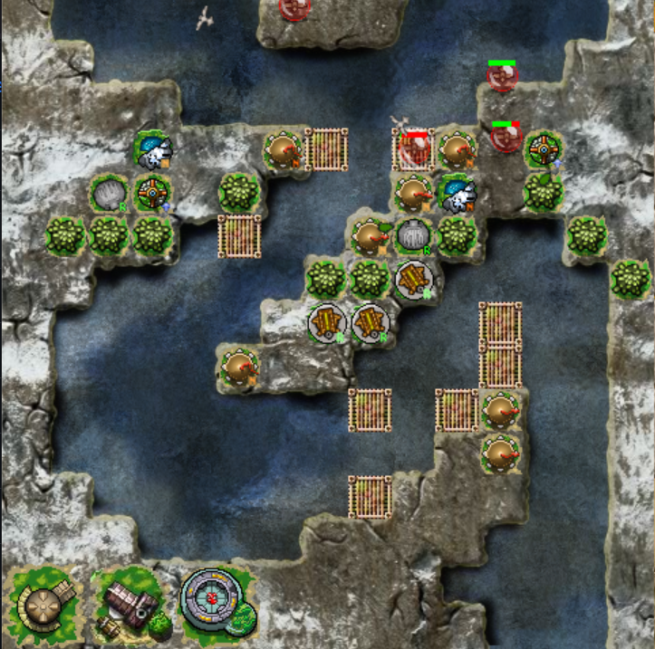

# viking-defense-reforged
 Viking Defense Reforged is a personal project to recreate the old Flash-based game Viking Defense. I've tried to recreate the original as faithfully as possible, while fixing a few annoying bugs along the way. 

 
 
 
## How to install
 ### Method 1 : download an executable (Windows Only)
 1. Go to the [latest release](https://github.com/NilsApffel/viking-defense-reforged/releases) and download the executable file from there. 
 ### Method 2 : run the python code
 1. You will need python 3.8 or newer, and the `arcade` library (type `pip install arcade==2.6.17` into a command window)
 2. Download the source code .zip file from the [latest release](https://github.com/NilsApffel/viking-defense-reforged/releases) page, and extract it to some convenient location
 3. Navigate to the newly-created `viking-defense-reforged` folder in a command window, and run `python main.py` to start the game
 You can also use [pyinstaller](https://pyinstaller.org/en/stable/) to recompile the game into an executable on your device. 
